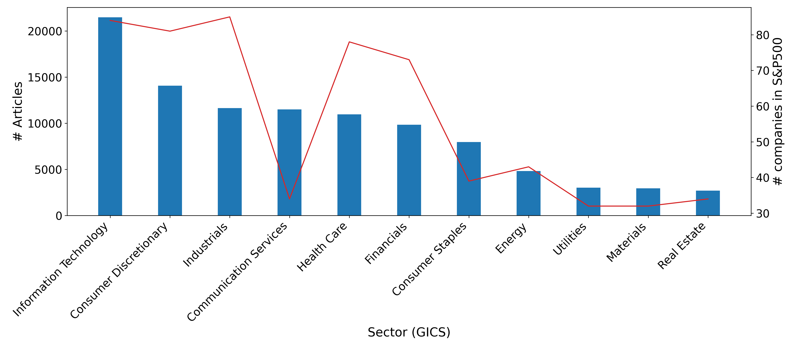
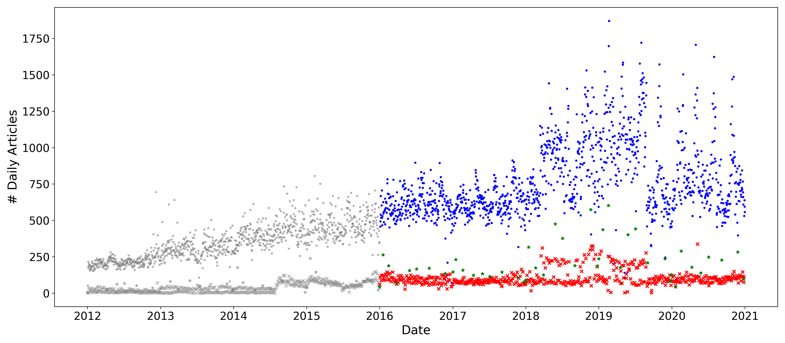
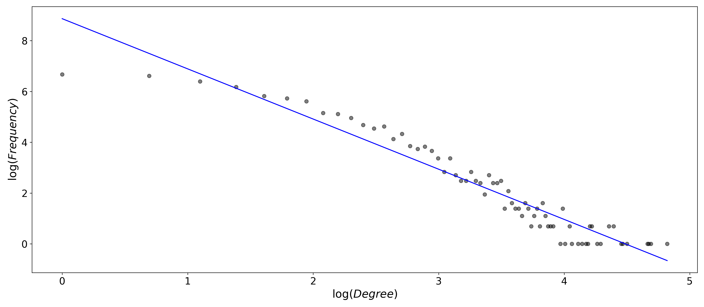
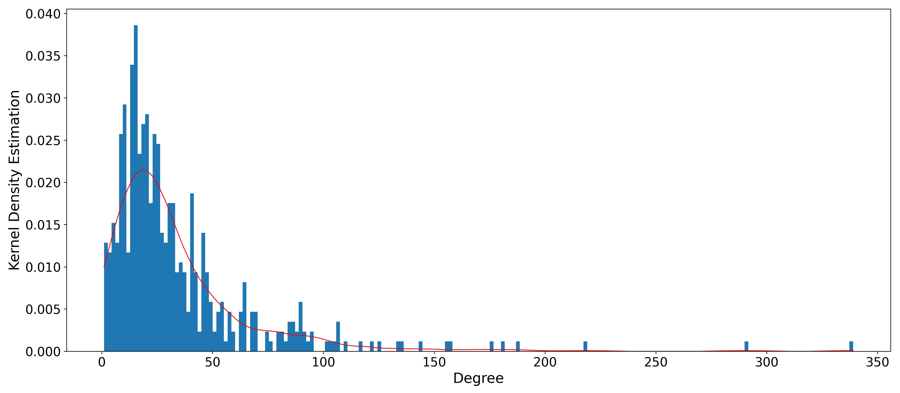
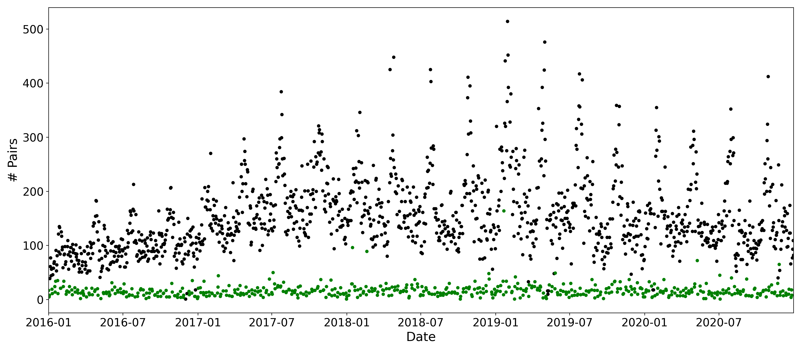
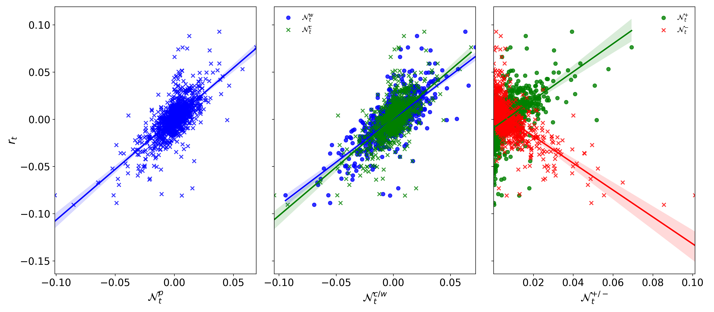
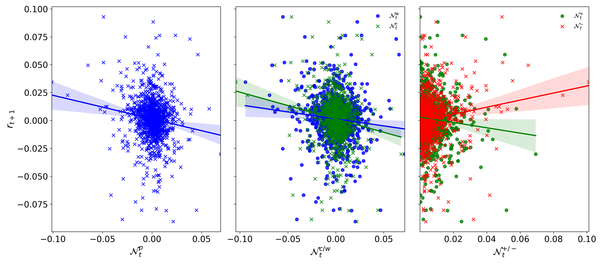

[](http://quantlet.de/)

## [](http://quantlet.de/) **NN_Variables** [](http://quantlet.de/)

```yaml

Name of QuantLet : NN_Variables

Published in : 'Networks of News and Cross-Sectional Returns'

Description : 'Inspect the derived variables from the News Network, Plots and Stats'

Keywords : Textual Analysis, Network Analysis

See also : ''

Author : Junjie Hu

```















### PYTHON Code
```python

import sys
import os

sys.path.extend([os.getcwd() + '/NetworkVariables_Analysis/'])
import pandas as pd
import matplotlib.pyplot as plt
import statsmodels.api as sm
from Aux_funcs import generate_holidays, PlotKernelDensityEstimator
import pickle
import numpy as np
import datetime as dt
import networkx as nx
import seaborn

full_figsize = (16, 7)
tick_size = 16
label_size = 18
title_size = 20
bar_width = 0.65
bar_thick_width = 2

date_range_used = [dt.datetime(2016, 1, 1), dt.datetime(2021, 1, 1)]
lead_articles = pd.read_csv(os.getcwd() + '/NetworkVariables_Analysis/SPX_articles_lead.csv', index_col=0, parse_dates=True)
"""
Article number evolving
"""


def holidays_weekends_filter(ts_df):
    exchange_holidays = generate_holidays()
    ts_df['days'] = ts_df.index.dayofweek
    workingdays = ts_df[~(ts_df.days.isin([5, 6]))]

    holidays = pd.DataFrame()
    for date in exchange_holidays:
        print(date)
        holiday = workingdays[workingdays.index.date == date]
        holidays = pd.concat([holidays, holiday], axis=0)
        workingdays = workingdays[~(workingdays.index.date == date)]
    weekends = ts_df[ts_df.days.isin([5, 6])]
    return workingdays, weekends, holidays


def compute_attention_var(adj_matrix, date):
    # Create the attention variable, degrees from the past 12-month
    agg_adj_unitic_unweight = adj_matrix.copy(deep=True)
    for col in agg_adj_unitic_unweight.columns:
        weighted_values = agg_adj_unitic_unweight.loc[:, col].values.tolist()
        unweighted_values = [1 if val != 0 else 0 for val in weighted_values]
        agg_adj_unitic_unweight.loc[:, col] = unweighted_values
    row_sum = agg_adj_unitic_unweight.sum(axis=0)
    col_sum = agg_adj_unitic_unweight.sum(axis=1)
    attention = row_sum + col_sum
    attention = attention.to_frame(date)
    attention = attention.transpose()
    return attention, row_sum, col_sum


with open(os.getcwd() + '/NetworkVariables_Analysis/ArticleNum.pkl', 'rb') as num_rick:
    articles_num = pickle.load(num_rick)

articles_num_unused = articles_num.loc[articles_num.index < date_range_used[0].date()]
articles_num_used = articles_num.loc[articles_num.index >= date_range_used[0].date()]

plt.figure(figsize=full_figsize)
plt.scatter(x=articles_num_unused.index, y=articles_num_unused['workdays'], s=20, c='grey', marker='.',
            alpha=0.5)
plt.scatter(x=articles_num_unused.index, y=articles_num_unused['weekends'], s=20, c='grey', marker="x",
            alpha=0.5)
plt.scatter(x=articles_num_unused.index, y=articles_num_unused['holidays'], s=20, c='grey', marker="*",
            alpha=0.5)
plt.scatter(x=articles_num_used.index, y=articles_num_used['workdays'], s=20, c='b', marker='.',
            label='NASDAQ Open Day')
plt.scatter(x=articles_num_used.index, y=articles_num_used['weekends'], s=20, c='r', marker="x", label='Weekends')
plt.scatter(x=articles_num_used.index, y=articles_num_used['holidays'], s=20, c='g', marker="*",
            label='NASDAQ Holiday Day')
plt.xlabel('Date', fontsize=label_size)
plt.ylabel('# Daily Articles', fontsize=label_size)
plt.xticks(fontsize=tick_size)
plt.yticks(fontsize=tick_size)
plt.tight_layout()
plt.savefig(os.getcwd() + '/NetworkVariables_Analysis/NumberOfArticles_NoLegend.png', dpi=300)

"""Matched pairs over time"""
with open(os.getcwd() + '/NetworkVariables_Analysis/MatchedPaird_Num.pkl', 'rb') as num_rick:
    pairs_num = pickle.load(num_rick)

plt.figure(figsize=full_figsize)
plt.scatter(x=pairs_num.index, y=pairs_num['workdays'], s=15, color='k')
plt.scatter(x=pairs_num.index, y=pairs_num['weekends'], s=15, color='g')
plt.scatter(x=pairs_num.index, y=pairs_num['holidays'], s=15, color='g')
plt.xticks(fontsize=tick_size)
plt.xlabel('Date', fontsize=label_size)
plt.ylabel('# Pairs', fontsize=label_size)
plt.yticks(fontsize=tick_size)
plt.xlim([pairs_num['workdays'].index[0], pairs_num['workdays'].index[-1]])
plt.tight_layout()
plt.savefig(os.getcwd() + '/NetworkVariables_Analysis/matched_pairs_overtime.png', dpi=300)

"""Attention dispersion among sectors"""

spx_symbols = pd.read_csv(os.getcwd() + '/NetworkVariables_Analysis/SPX_TickersEvolv_NameSector.csv', index_col=0,
                          parse_dates=True)
spx_symbols = spx_symbols.loc[(spx_symbols.index.year >= 2016) & (spx_symbols.index.year < 2022)]
spx_symbols_unique = spx_symbols.drop_duplicates(subset=['Ticker', 'Sector'])
unique_tickers_sectors = spx_symbols_unique['Sector']
sectors_freq = unique_tickers_sectors.value_counts().to_frame()
leader_sectors_counts = lead_articles['l_sector'].value_counts().to_frame()
leader_sectors_counts = leader_sectors_counts.join(sectors_freq)

fig, ax1 = plt.subplots(figsize=full_figsize)
ax1.bar(x=leader_sectors_counts.index, height=leader_sectors_counts['l_sector'].values, width=0.4, color='tab:blue')
for label in ax1.get_xticklabels():
    label.set_ha("right")
    label.set_rotation(45)

ax1.set_ylabel('# Articles', fontsize=label_size)
ax1.tick_params(axis='both', which='both', labelsize=tick_size)
ax1.set_xlabel('Sector (GICS)', fontsize=label_size)
ax2 = ax1.twinx()
ax2.plot(leader_sectors_counts.index, leader_sectors_counts['Sector'].values, color='tab:red')
ax2.set_ylabel('# companies in S&P500', fontsize=label_size)
ax2.tick_params(axis='both', which='both', labelsize=tick_size)
fig.tight_layout()
fig.savefig(os.getcwd() + '/NetworkVariables_Analysis/AttentionOnSectors.png', dpi=300)

"""Degree distribution of daily aggregated network"""

adj_dir = os.path.join(os.getcwd(), 'NewsNetwork_Formation', 'AdjacencyMatrix/', 'All Sectors')
adj_files = [file for file in os.listdir(adj_dir) if file.endswith('.csv')]

adj_files.sort()

sample_period_degrees = list()
sample_period_indegrees = list()
sample_period_outdegrees = list()

for file in adj_files:
    date = dt.datetime.strptime(file[0:10], '%Y-%m-%d')
    adj_file = pd.read_csv(adj_dir + f'/{file}', index_col=0)
    network_adj = nx.convert_matrix.from_pandas_adjacency(adj_file, nx.DiGraph)
    degree = nx.degree(network_adj)
    outdegree_cent = nx.in_degree_centrality(network_adj)
    indegree_cent = nx.out_degree_centrality(network_adj)

    non_zero_degrees = {k: v for (k, v) in dict(degree).items() if v != 0}
    non_zero_indegrees = {k: int(round(v * (len(network_adj) - 1), 1)) for (k, v) in dict(indegree_cent).items() if
                          v != 0}
    non_zero_outdegrees = {k: int(round(v * (len(network_adj) - 1), 1)) for (k, v) in dict(outdegree_cent).items() if
                           v != 0}

    sample_period_degrees.extend(non_zero_degrees.values())
    print(date)
    print(f'Total Nonzero nodes: {len(non_zero_degrees)}')
    print(f'Total Degree: {sum(non_zero_degrees.values())}')
    print('======================')

degrees_valuescount = pd.value_counts(sample_period_degrees)
degrees_valuescount.sort_index(axis=0, inplace=True)
log_degree = np.log(degrees_valuescount.index)
log_counts = np.log(degrees_valuescount)

# Estimation of the degree exponent of daily aggregated network
reg_x = sm.add_constant(log_degree.tolist())
reg_y = log_counts.tolist()
linear_model = sm.OLS(reg_y, reg_x)
fit_lm = linear_model.fit()
fit_lm.summary()
line_x = np.linspace(log_degree.min(), log_degree.max(), 500)
line_y = fit_lm.params[0] + fit_lm.params[1] * line_x

x_axis = degrees_valuescount.index
y_values = degrees_valuescount.values / len(sample_period_degrees)

fig = plt.figure(figsize=full_figsize)
plt.scatter(x=log_degree, y=log_counts, alpha=0.5, c='k', edgecolors='face')
plt.xlabel('$\log(Degree)$', fontsize=label_size)
plt.xticks(fontsize=tick_size)
plt.ylabel('$\log(Frequency)$', fontsize=label_size)
plt.yticks(fontsize=tick_size)
plt.plot(line_x, line_y, color='blue')
plt.tight_layout()
fig.savefig(os.getcwd() + f'/NetworkVariables_Analysis/degree_distribution_loglog_monthly.png', dpi=300)

"""Degree distribution of network in whole sample period"""
adj_dir = os.path.join(os.getcwd(), 'NewsNetwork_Formation', 'AdjacencyMatrix/', 'FullSample_All Sectors')
obj_files = [file for file in os.listdir(adj_dir) if file.endswith('.csv')]
adj_file = pd.read_csv(adj_dir + f'/{obj_files[0]}', index_col=0)
fullsample_adj = nx.convert_matrix.from_pandas_adjacency(adj_file, nx.DiGraph)

fullsample_degree = nx.degree(fullsample_adj)

fullsample_non_zero_degrees = list({k: v for (k, v) in dict(fullsample_degree).items() if v != 0}.values())
fullsample_non_zero_logdegrees = list({k: np.log(v) for (k, v) in dict(fullsample_degree).items() if v != 0}.values())
kde_degrees_fullsample = PlotKernelDensityEstimator(fullsample_non_zero_degrees)

# Plot the KDE
fig = plt.figure(figsize=full_figsize)
kde_fullsample_bd_plotfig = kde_degrees_fullsample.plot_curve_hist_kde(bandwidth=20, bin_num=200)
plt.xticks(fontsize=tick_size)
plt.xlabel("Degree", fontsize=label_size)
plt.ylabel('Kernel Density Estimation', fontsize=label_size)
plt.yticks(fontsize=tick_size)
plt.tight_layout()
fig.savefig(os.getcwd() + '/NetworkVariables_Analysis/fullsample_degree_kde_2016.png', dpi=300)

samplefirm_mixoverall = pd.read_csv(os.getcwd() + '/NetworkVariables_Analysis/RegSample_AAPL_MixSector.csv', index_col=0)
samplefirm_intraover = pd.read_csv(os.getcwd() + '/NetworkVariables_Analysis/RegSample_AAPL_WithinSector.csv', index_col=0)
samplefirm_crossoverall = pd.read_csv(os.getcwd() + '/NetworkVariables_Analysis/RegSample_AAPL_CrossSector.csv', index_col=0)
mix_pos_nnf = pd.read_csv(os.getcwd() + '/NetworkVariables_Analysis/RegSample_AAPL_Pos.csv', index_col=0)
mix_neg_nnf = pd.read_csv(os.getcwd() + '/NetworkVariables_Analysis/RegSample_AAPL_NegSector.csv', index_col=0)

"""
Co-movement plot
"""
scatter_fig, (ax1, ax2, ax3) = plt.subplots(nrows=1, ncols=3, sharey=True, figsize=full_figsize)
seaborn.regplot(x='nnf_MixSector_overall', y='r_t0', data=samplefirm_mixoverall, ax=ax1, marker="x", color='blue')
ax1.set_ylabel('$r_{t}$', fontsize=label_size)
ax1.tick_params(axis='both', which='both', labelsize=tick_size)
ax1.set_xlabel('$\mathcal{N}^{p}_t$', fontsize=label_size)

seaborn.regplot(x='nnf_IntraSector_overall', y='r_t0', data=samplefirm_intraover, ax=ax2, marker="o", color='blue',
                label='$\mathcal{N}^{w}_t$')
seaborn.regplot(x='nnf_InterSector_overall', y='r_t0', data=samplefirm_crossoverall, ax=ax2, marker="x",
                color='green', label='$\mathcal{N}^{c}_t$')
ax2.set_ylabel('', fontsize=label_size)
ax2.tick_params(axis='both', which='both', labelsize=tick_size)
ax2.set_xlabel('$\mathcal{N}^{c/w}_t$', fontsize=label_size)
ax2.legend(fontsize='large', frameon=False)

seaborn.regplot(x='nnf_MixSector_pos', y='r_t0', data=mix_pos_nnf, ax=ax3, marker="o", color='green',
                label='$\mathcal{N}^{+}_t$')
seaborn.regplot(x='nnf_MixSector_neg', y='r_t0', data=mix_neg_nnf, ax=ax3, marker="x", color='red',
                label='$\mathcal{N}^{-}_t$')
ax3.set_ylabel('', fontsize=label_size)
ax3.tick_params(axis='both', which='both', labelsize=tick_size)
ax3.set_xlabel('$\mathcal{N}^{+/-}_t$', fontsize=label_size)
ax3.legend(fontsize='large', frameon=False)
scatter_fig.tight_layout()

plt.savefig(os.getcwd() + f'/NetworkVariables_Analysis/return_factor_comovement_secotr_sign_scatterplot_AAPL.png', dpi=300)

"""
1-day ahead predictability
"""

scatter_fig, (ax1, ax2, ax3) = plt.subplots(nrows=1, ncols=3, sharey=True, figsize=full_figsize)
seaborn.regplot(x='nnf_MixSector_overall', y='r_t1', data=samplefirm_mixoverall, ax=ax1, marker="x", color='blue')
ax1.set_ylabel('$r_{t+1}$', fontsize=label_size)
ax1.tick_params(axis='both', which='both', labelsize=tick_size)
ax1.set_xlabel('$\mathcal{N}^{p}_t$', fontsize=label_size)

seaborn.regplot(x='nnf_IntraSector_overall', y='r_t1', data=samplefirm_intraover, ax=ax2, marker="o", color='blue',
                label='$\mathcal{N}^{w}_t$')
seaborn.regplot(x='nnf_InterSector_overall', y='r_t1', data=samplefirm_crossoverall, ax=ax2, marker="x",
                color='green', label='$\mathcal{N}^{c}_t$')
ax2.set_ylabel('', fontsize=label_size)
ax2.tick_params(axis='both', which='both', labelsize=tick_size)
ax2.set_xlabel('$\mathcal{N}^{c/w}_t$', fontsize=label_size)
ax2.legend(fontsize='large', frameon=False)

seaborn.regplot(x='nnf_MixSector_pos', y='r_t1', data=mix_pos_nnf, ax=ax3, marker="o", color='green',
                label='$\mathcal{N}^{+}_t$')
seaborn.regplot(x='nnf_MixSector_neg', y='r_t1', data=mix_neg_nnf, ax=ax3, marker="x", color='red',
                label='$\mathcal{N}^{-}_t$')
ax3.set_ylabel('', fontsize=label_size)
ax3.tick_params(axis='both', which='both', labelsize=tick_size)
ax3.set_xlabel('$\mathcal{N}^{+/-}_t$', fontsize=label_size)
ax3.legend(fontsize='large', frameon=False)
scatter_fig.tight_layout()

plt.savefig(os.getcwd() + f'/NetworkVariables_Analysis/return_factor_pred1_sector_sign_scatterplot_AAPL.png', dpi=300)

```

automatically created on 2021-09-17